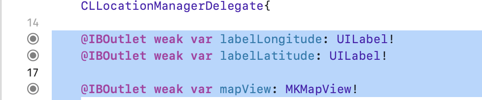
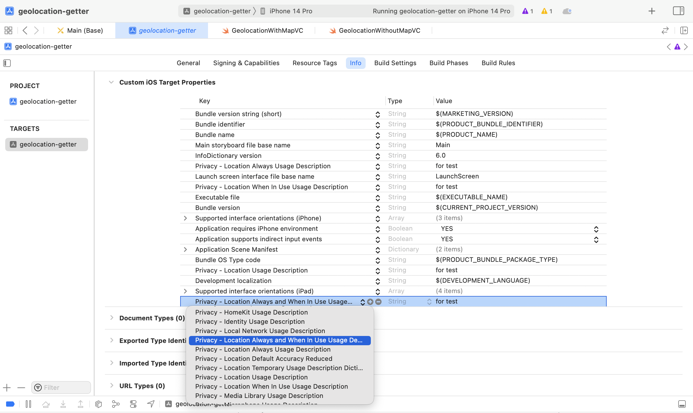
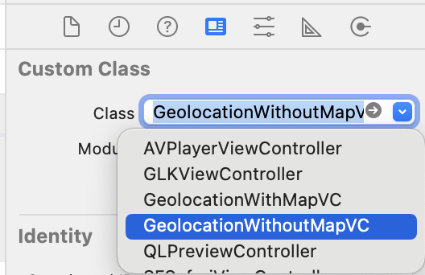

# Geolocation Getter

This is a simple iOS app that demonstrates how to get the user's current location using the CoreLocation framework in Swift. There are two view controllers included in this project:

## Setup
Make sure to add and build the connection with these two UILabels and a map view to the view controller in the storyboard



```sh swift
@IBOutlet weak var labelLongitude: UILabel!
@IBOutlet weak var labelLatitude: UILabel!
@IBOutlet weak var mapView: MKMapView!
```

Make sure to include the following in your project configuration to grant privacy access to the phone. This is necessary to obtain the user's geolocation information.



#### **GeolocationWithMapVC**
This view controller displays the user's current location on a map view, as well as the latitude and longitude coordinates in UILabels. It uses the CLLocationManagerDelegate and MKMapViewDelegate protocols to update the user's location and customize the map view's annotations.

#### **GeolocationWithoutMapVC**
This view controller displays the user's current latitude and longitude coordinates in UILabels without a map view. It uses the CLLocationManagerDelegate protocol to update the user's location.


To use these two view controllers in your own project, simply copy the **GeolocationWithMapVC.swift/GeolocationWithoutMapVC** file into your Xcode project and add a new view controller to your storyboard. Then, set the custom class of the view controller to GeolocationWithMapVC in the Identity Inspector tab of the Utilities panel. 

## Demo

<video width="640" height="360" controls>
  <source src="img/demo.mp4" type="video/mp4">
</video>
